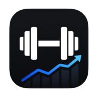

# Consumption Tracker

A minimal consumption tracker built with Go.

---

## 📌 About

**Consumption Tracker** helps you track your resource usage over time.

Record consumption data for electricity, oil, and water, then review your history and usage trends.

The application is designed to be lightweight, fast, and simple with a minimal frontend and no unnecessary complexity.

The application is PWA ready and can be used like a native application.

No external dependencies are required.

---

## 🖼️ Screenshots

### Desktop

### Mobile

---

## 🛠️ Built With

- Go
- Pico CSS
- Chart.js
- Font Awesome

All assets are bundled locally.

---

## 📚 Related Projects

- [Strength Tracker](https://github.com/lukas-arnold/strength-tracker)
- [Garden Equipment Log](https://github.com/lukas-arnold/garden-equipment-log)

---

## 📄 License

MIT License
